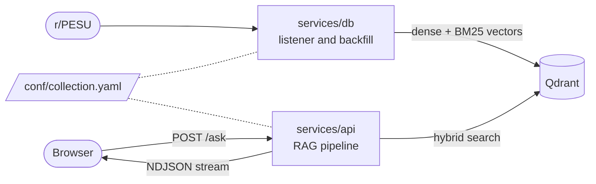

# ask-pesu

A retrieval-augmented question answering system for PES University, answering from
[r/PESU](https://www.reddit.com/r/PESU/) discussions.

This monorepo holds two services:

| Path | Service | What it does | Hugging Face Spaces |
|---|---|---|---|
| [`services/api`](services/api) | **AskPESU** | Answers questions: a FastAPI + LangChain RAG backend, and the React frontend it serves | [askpesu](https://pesu-dev-askpesu.hf.space) (production), [askpesu-dev](https://pesu-dev-askpesu-dev.hf.space) (development) |
| [`services/db`](services/db) | **AskPESU DB** | Streams new r/PESU comment threads into Qdrant, and holds the scripts that backfill its history | [askpesu-db](https://pesu-dev-askpesu-db.hf.space), one instance for both api environments |

## How it works



The db service indexes each Reddit comment thread, together with the post it belongs to, as one
document. For each question, the api service:

1. rewrites follow-up questions into standalone ones;
2. writes a few alternative phrasings;
3. runs a hybrid dense and keyword search in Qdrant for each phrasing;
4. reranks the results with a cross-encoder;
5. streams an answer from a Qwen3 model, together with the threads it drew on.

Both services validate the collection's shape against `conf/collection.yaml` when they start.

## Quick start

You need [uv](https://docs.astral.sh/uv/getting-started/installation/) and, for frontend work,
Node.js 24. uv fetches Python 3.12 itself.

```bash
git clone https://github.com/pesu-dev/ask-pesu.git
cd ask-pesu
uv sync --extra api --extra db
cp .env.example .env               # then fill it in
```

Run the api with a working UI and no credentials, serving canned answers:

```bash
cd services/api
ENV=test uv run python -m app.app  # http://localhost:7860

# in a second terminal
cd services/api/frontend
npm ci
npm run dev                        # http://localhost:8080
```

To answer real questions, set the Qdrant variables and `HF_TOKEN` in `.env`, then run the api
without `ENV=test`. [Development](docs/development.md) covers the full setup, running the db
listener, answering from a local ollama, and Docker.

## Documentation

| Document | Covers |
|---|---|
| [Architecture](docs/architecture.md) | The two services, the repository layout, and where to make a change |
| [The answering pipeline](docs/pipeline.md) | How `services/api` turns a question into a streamed answer |
| [Ingestion](docs/ingestion.md) | How `services/db` indexes threads, and how to backfill history |
| [The collection contract](docs/collection-contract.md) | `conf/collection.yaml`, the Qdrant collections, and how shared files reach each Space |
| [HTTP API](docs/api.md) | Every route of both services, and the NDJSON streaming protocol |
| [Configuration](docs/configuration.md) | Environment variables and `services/api/conf/config.yaml` |
| [Frontend](docs/frontend.md) | The React app in `services/api/frontend` |
| [Failure handling](docs/failure-handling.md) | Quota cooldowns, and what happens when each dependency fails |
| [Development](docs/development.md) | Dependencies, running the services, Docker, tests and linting |
| [CI and deployment](docs/ci-cd.md) | Workflows, deploying to the Spaces, and rollback |
| [Design decisions](docs/decisions/README.md) | Settled decisions, and the issues that record why |

## Contributing

Pull requests come from a fork, from a branch other than `main`, and target `dev`. Read
[CONTRIBUTING.md](.github/CONTRIBUTING.md) and the [Code of Conduct](.github/CODE_OF_CONDUCT.md)
first. Security issues go to the maintainers privately; see [SECURITY.md](.github/SECURITY.md).

## License

[MIT](LICENSE).
