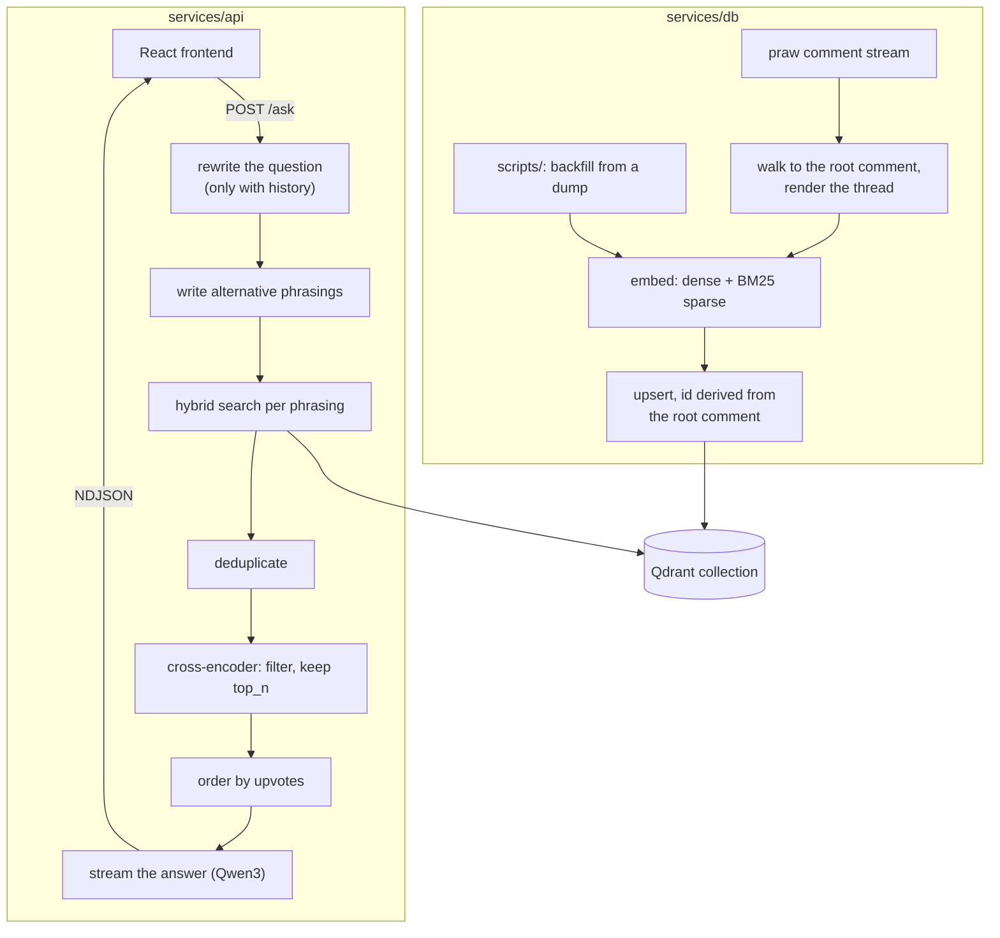

# Architecture

ask-pesu answers questions about PES University from r/PESU discussions. It has two services that
share one Qdrant collection:

- **AskPESU** (`services/api`) reads the collection. It runs the retrieval-augmented generation
  pipeline behind `POST /ask` and serves the React frontend from the same origin.
- **AskPESU DB** (`services/db`) writes the collection. It listens to new r/PESU comments and
  indexes the thread each one belongs to. Its `scripts/` directory backfills history from a Reddit
  dump.



[pipeline.md](pipeline.md) describes the reader and [ingestion.md](ingestion.md) the writer.

## Deployment shape

Three Hugging Face Spaces run the two services:

| Space | Service | Deployed from | Collection |
|---|---|---|---|
| [`askpesu`](https://huggingface.co/spaces/pesu-dev/askpesu) | api | `main`, by a manual production deploy | `ask-pesu-prod` |
| [`askpesu-dev`](https://huggingface.co/spaces/pesu-dev/askpesu-dev) | api | `dev`, on every push | `ask-pesu-prod` |
| [`askpesu-db`](https://huggingface.co/spaces/pesu-dev/askpesu-db) | db | `main`, by a manual production deploy | `ask-pesu-prod` |

There is one db Space, so there is one deployed collection. Both api Spaces read what it writes.
[ci-cd.md](ci-cd.md) describes the deploys, and
[collection-contract.md](collection-contract.md#collections-and-keys) describes the collections.

## Each service is shaped like a repository root

A deploy pushes a `git subtree split --prefix=services/<name>` to the Space, so the Space receives
only that service's directory. The repository root never reaches a Space. As a result:

- Each service has its own `README.md` (whose frontmatter configures the Space), its own
  `Dockerfile`, its own `.dockerignore` and its own `app/` package.
- The services cannot import from a shared directory. Code both need, such as the contract
  loader, exists once per service, and [`scripts/check_duplication.py`](../scripts/check_duplication.py)
  checks that the copies agree. See [development.md](development.md#checks-that-pairs-of-files-agree).
- Files both services need at runtime, such as `conf/collection.yaml` and `requirements.txt`,
  are authored once at the root and copied into the service directory at build and deploy time.
  See [collection-contract.md](collection-contract.md#shared-files-and-vendoring).

## Repository layout

```
.
├── conf/collection.yaml      # the Qdrant collection contract, shared by both services
├── .env.example              # every environment variable, for both services
├── pyproject.toml            # dependencies for both services, and the ruff configuration
├── requirements.txt          # compiled from pyproject.toml; what the images install
├── uv.lock                   # the lockfile uv sync installs from
├── LICENSE
├── .python-version           # 3.12
├── .pre-commit-config.yaml
├── docs/                     # this documentation
├── notebooks/
│   └── backfill.ipynb        # runs the backfill on a local or hosted GPU kernel
├── scripts/
│   └── check_duplication.py  # checks that files which cannot share code still agree
├── .github/
│   ├── actions/deploy-space/ # the deploy implementation, used by both deploy workflows
│   └── workflows/            # CI and deploys
└── services/
    ├── api/
    │   ├── app/
    │   │   ├── app.py        # routes, lifespan, static file serving
    │   │   ├── rag.py        # the retrieval and generation pipeline
    │   │   ├── quota.py      # per-model cooldowns
    │   │   ├── local_llm.py  # the chat models served by a local ollama
    │   │   ├── contract.py   # reader side of the collection contract
    │   │   ├── models/       # pydantic request and response schemas
    │   │   └── docs/         # OpenAPI examples, one module per route
    │   ├── conf/config.yaml  # prompts, model ids, retrieval and reranking settings
    │   ├── frontend/         # Vite + React 18 + TypeScript + shadcn/ui
    │   ├── .dockerignore
    │   ├── Dockerfile        # builds the frontend, then the API image
    │   └── README.md         # Space page and frontmatter for askpesu and askpesu-dev
    └── db/
        ├── app/
        │   ├── app.py        # the Reddit listener and its status routes
        │   ├── utils.py      # thread rendering and point ids, shared with the backfill
        │   └── contract.py   # writer side of the collection contract
        ├── scripts/
        │   ├── generate_processed_data.py  # raw Reddit dump -> one JSON file per post
        │   └── populate_db.py              # those files -> Qdrant
        ├── .dockerignore
        ├── Dockerfile
        └── README.md         # Space page and frontmatter for askpesu-db
```

`dump/`, where the backfill expects raw Reddit exports, is gitignored.

## Where to make a change

| To change… | Edit |
|---|---|
| Prompts, model ids, retrieval and reranking settings | `services/api/conf/config.yaml` |
| The retrieval and generation pipeline | `services/api/app/rag.py` |
| Routes, CORS, static serving, startup | `services/api/app/app.py` |
| Request and response schemas, OpenAPI examples | `services/api/app/models/`, `services/api/app/docs/` |
| Cooldown behaviour | `services/api/app/quota.py` |
| Running against a local ollama | `services/api/app/local_llm.py` |
| What gets indexed, and how a thread is rendered | `services/db/app/app.py`, `services/db/app/utils.py`, and `services/db/scripts/populate_db.py`, which builds the same document text |
| The backfill | `services/db/scripts/`, `notebooks/backfill.ipynb` |
| Embedding model, vector geometry, payload keys | `conf/collection.yaml` |
| A stream event type | `services/api/app/models/response/ask.py`, `services/api/app/rag.py` and `services/api/frontend/src/lib/api.ts` |
| Dependencies | `pyproject.toml`, then recompile `requirements.txt`; see [development.md](development.md#dependencies) |
