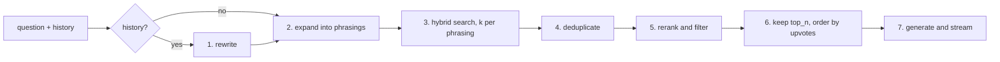

# The answering pipeline

`POST /ask` in `services/api` answers a question from the Qdrant collection and streams the
result as newline-delimited JSON. The pipeline is `RetrievalAugmentedGenerator` in
`services/api/app/rag.py`. It is built once, when the server starts, and shared by every request.

The settings named below are in `services/api/conf/config.yaml`, under `rag`. See
[configuration.md](configuration.md#servicesapiconfconfigyaml) for all of them.

## Stages

### 1. Rewrite

When the request carries history, the question and the history are rewritten into one standalone
query with `prompts.rewrite_prompt`, so that "is it hard?" becomes something retrievable. With no
history the question is searched as asked, and this LLM call is skipped.

The prompt tells the model to expand PESU abbreviations next to the original, as in
`CSE (Computer Science Engineering)`, because the keyword half of the search matches the literal
token. The model does not always keep abbreviations it resolves from the history, so
`preserve_acronyms()` appends any that are missing from the rewrite. It takes them from the
question, or, when the question has none, from the previous user turn.

The rewrite receives the whole conversation (up to `limits.history_turns`).

### 2. Multi-query expansion

`MultiQueryRetriever` asks the LLM for `retrieval.query_expansions` alternative phrasings of the
query, with `prompts.multi_query_prompt`, and searches with each. The query from stage 1 is
searched too (`include_original=True`), so `query_expansions + 1` searches run. They run
concurrently.

The output parser keeps every non-empty line of the model's response as a phrasing, so the prompt
asks for one phrasing per line and nothing else.

### 3. Retrieval

Each phrasing retrieves `retrieval.k` documents through `ScoredRetriever`, which stores each
document's score in `metadata["_score"]`.

- **`hybrid`** (the default) queries the dense vector and the BM25 sparse vector, and Qdrant fuses
  the two rankings with Reciprocal Rank Fusion. The fused score comes from rank positions, not
  similarity, so it cannot be thresholded.
- **`dense`** queries the dense vector alone. `retrieval.score_threshold`, if set, is a cosine
  cutoff that Qdrant applies. It must be `null` under `hybrid`, and startup refuses otherwise.

The candidate pool is at most `(query_expansions + 1) × k` documents. Every one of them is scored
by the cross-encoder before the first token is streamed, so `k` trades recall against time to
first token.

### 4. Deduplication

Several phrasings often find the same point. `deduplicate()` collapses the pool on the stored
point id (`metadata["_id"]`) and keeps the copy with the best score. It runs before reranking, so
the cross-encoder scores each point once.

### 5. Rerank

`rerank.model` (a cross-encoder) scores each (query, document) pair together, through a sigmoid,
so scores fall between 0 and 1. Documents below `rerank.score_threshold` are dropped, and the rest
are sorted by score.

- **This is the only stage that drops a document for being a poor answer.** `k` limits how much is
  retrieved and `top_n` how much the model reads, but neither judges relevance.
- **It scores the search query**, the rewritten form from stage 1, not the question as asked.
- **It scores each document without the post body** (`_without_body()`): the title, then the
  comment tree. The post body is the same in every document from a post and would otherwise fill
  the cross-encoder's input window. The answer prompt still receives the whole document.
- **It runs off the event loop**, in a worker thread, behind a semaphore of size
  `rerank.concurrency`.

If nothing clears the cutoff, the answer prompt receives no context and the system prompt makes
the model say it does not have the information.

`rerank.enabled: false` skips this stage and orders documents by their retrieval score. It is only
allowed under `dense`: under `hybrid` nothing would judge relevance, and startup refuses the
combination.

### 6. Selection and ranking

The `rerank.top_n` highest-scoring documents are kept. `rank()` then orders them by
`root_comment_score`, the upvotes on the answer, highest first.

- The sort is on the raw upvote count, with no weights or normalisation.
- The sort is stable. Most answers have few upvotes, so ties are common, and tied documents keep
  their cross-encoder order.
- A missing score counts as zero, which places it above downvoted answers and below upvoted ones.
- Nothing limits how many documents one post contributes. Several documents from one post are
  several different replies to it.

[Decision 0003](decisions/0003-rank-by-upvotes.md) records why ranking works this way.

### 7. Generation

The retrieved threads are reported first, as one `sources` event. The answer is then streamed
token by token. See [api.md](api.md#the-streaming-protocol) for the events.

The answer prompt is built from three parts, in order:

1. `prompts.system_prompt`: answer only from the context, do not list sources, say which year a
   time-sensitive fact comes from, and decline questions unrelated to PES University.
2. The last `history.answer_turns` complete turns of the conversation, so the model can tell what
   a follow-up refers to. The system prompt forbids answering from them.
3. `prompts.answer_prompt`, filled with the question as asked and the context.

`format_docs()` builds the context. Documents from the same post are grouped under one heading, so
the post's title and body appear once, followed by each thread's comment tree. Each heading is the
post's permalink and the month it was posted, for example `(posted May 2024)`. The month is the
post's, not the reply's.

Stages 1 and 2 always use the **primary** model (`llm.primary`). The answer uses the primary model,
or the thinking model (`llm.thinking`) when the request sets `thinking: true`. The stages run as separate calls rather than as one
LangChain chain, so that the retrieved documents are available to report as sources.

### Thinking mode

The thinking model writes its reasoning inside `<think>…</think>` before the answer. The backend
streams the reasoning as `step` events and the answer as `token` events:

- Either tag can be split across two stream chunks. The backend holds back the last
  `len("</think>") - 1` characters until it can tell whether they complete the tag.
- Until enough text has arrived to tell whether the stream opens with `<think>`, nothing is
  emitted. A stream that does not open with it is treated as answer text from the start.
- If the token budget runs out before `</think>`, the remaining reasoning is sent as a `step` and
  an `error` event says the budget was spent on reasoning.
- If the stream ends with no answer text, an `error` event says so.

Under `LLM_MODE=ollama`, ollama returns reasoning in a separate field. `app/local_llm.py` wraps it
in `<think>` tags so the same code handles both.

## Conversation history

Conversations are stored only in the browser. The client sends previous turns as `history` with
each request.

- A turn whose `query` equals the current question is skipped.
- Only the last `limits.history_turns` turns are used. Older turns are dropped; the request is not
  refused.
- The rewrite (stage 1) receives all of those turns. The answer prompt receives only the last
  `history.answer_turns` turns that have both a question and an answer.

## Request limits

| Limit | Where | Effect |
|---|---|---|
| `query` longer than 2,000 characters | `AskRequestModel` | 422 |
| More than `limits.history_turns` turns | `generate()` | The oldest turns are dropped |
| The whole request exceeds `limits.timeout_seconds` | `generate()` | An `error` event, then `done` |
| One provider call exceeds `llm.*.timeout` | the chat model | An `error` event, then `done` |

The response status is sent before retrieval starts, so a timeout is reported in the stream, never
as a 504.

## Dates

Each `sources` entry carries `created_utc`, and each context heading carries the month the post was
made. There is no recency weight in retrieval or ranking; see
[decision 0004](decisions/0004-no-global-recency-weight.md).

## `/rewriteQuery`

`POST /rewriteQuery` is not part of this pipeline. It asks the primary model for a title of at
most eight words for the conversation sidebar, and cuts the result to eight words. See
[api.md](api.md#servicesapi).
